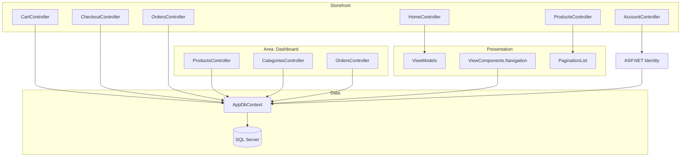

# TechEcommerce — ASP.NET Core MVC storefront

A full e-commerce web application built with ASP.NET Core MVC and Entity
Framework Core: product catalogue, database-backed shopping cart, multi-address
checkout, order history, and a separate administration area.

---

## Overview

The project covers the complete path of an online order — browsing a catalogue,
filling a cart, choosing a delivery address, placing an order — and the
administration side needed to keep that catalogue alive.

Two design choices are worth pointing out:

- **The cart lives in the database, not in the session.** A `Cart` row links a
  user, a product and a quantity. A customer who signs in on another machine
  finds their cart intact; an abandoned cart survives a server restart.
- **The back office is an MVC Area, not a set of guarded controllers.**
  `Areas/Dashboard` has its own routing, its own layout and its own controllers,
  which keeps administration concerns physically separate from the storefront.

Authentication is handled by ASP.NET Core Identity, configured with an explicit
password policy and account lockout after repeated failures.

---

## Tech stack


| Layer | Technology |
|---|---|
| Framework | ASP.NET Core MVC, .NET 9.0 |
| Language | C# |
| ORM | Entity Framework Core 9.0.6 (SQL Server provider) |
| Authentication | ASP.NET Core Identity 9.0.6 |
| Database | SQL Server (LocalDB or full instance) |
| Views | Razor (`.cshtml`) with runtime compilation |
| Tooling | EF Core Tools, VS Code Generation Design |

---

## Architecture

A conventional MVC layering, with the administration side isolated in an Area
and read models kept out of the entities through dedicated ViewModels.



### Domain model

| Entity | Role |
|---|---|
| `Product` | Catalogue item |
| `Category` | Product classification |
| `Cart` | One line per user and product, persisted in database |
| `Order` | Order header — user, address, amount, status, creation date |
| `OrderProduct` | Order line, joining an order to a product |
| `Address` | Delivery address, several per user |
| `Users` | Identity user, extended |

---

## Features

**Storefront**

- Product catalogue with paging (`Extensions/PaginationList`)
- Product detail pages
- Database-backed cart, surviving sessions and devices
- Checkout with selection among the customer's saved addresses
- Order history and order detail
- Navigation rendered by a dedicated ViewComponent

**Account**

- Registration, sign-in, sign-out
- Password change
- Email verification screen
- Password policy: minimum 8 characters, at least one digit, one uppercase and
  one lowercase letter; unique email required
- Lockout for 15 minutes after 5 failed attempts

**Administration** — `Areas/Dashboard`

- Full CRUD on products and categories
- Order management
- Dedicated layout, separate from the storefront

---

## Prerequisites

| Tool | Version |
|---|---|
| .NET SDK | 9.0 |
| SQL Server | 2019 or later, or SQL Server Express LocalDB |
| EF Core CLI | 9.0 — `dotnet tool install --global dotnet-ef` |
| Git | 2.40 or later |

Check your SDK:

```bash
dotnet --version
```

The output must start with `9.`.

---

## Local setup

Clone the repository:

```bash
git clone https://github.com/NABIHAyman/DemoTechEcommerceMVC.git
cd DemoTechEcommerceMVC
```

Restore dependencies:

```bash
dotnet restore
```

Configure the database connection. The committed `appsettings.json` uses
Windows integrated authentication against a local default instance:

```
Data Source=.;Initial Catalog=TechEcommerceDb;Integrated Security=True;Trust Server Certificate=True
```

To point somewhere else without editing the tracked file, use user secrets:

```bash
dotnet user-secrets init --project DemoTechEcommerceMVC
dotnet user-secrets set "ConnectionStrings:DefaultConnection" "<your connection string>" --project DemoTechEcommerceMVC
```

Create the schema — the project ships 21 migrations:

```bash
dotnet ef database update --project DemoTechEcommerceMVC
```

Run the application:

```bash
dotnet run --project DemoTechEcommerceMVC
```

| URL | Protocol |
|---|---|
| `https://localhost:7257` | HTTPS |
| `http://localhost:5064` | HTTP |

The administration area is reachable at `/Dashboard`.

> There is no data seeder. The catalogue starts empty — create a first account,
> then add categories and products through the Dashboard area.

---

## Deployment

The full server-side procedure is documented in
**[`DEPLOYMENT.md`](DEPLOYMENT.md)**: publishing, hosting under IIS or Kestrel
behind Nginx, systemd unit, HTTPS and database migration.

### Configuration to define

No values are given here on purpose.

| Key | Role |
|---|---|
| `ConnectionStrings:DefaultConnection` | SQL Server connection string |
| `ASPNETCORE_ENVIRONMENT` | `Production` on a server |
| `ASPNETCORE_URLS` | Addresses Kestrel binds to |
| `Logging:LogLevel:Default` | Log verbosity |

> In production, supply these through environment variables or a secret store —
> never by editing `appsettings.json` in the repository.

---

## Project structure

```
DemoTechEcommerceMVC/
├── DemoTechEcommerceMVC.sln
└── DemoTechEcommerceMVC/
    ├── Areas/
    │   └── Dashboard/           # Back office: own routing, layout, controllers
    │       ├── Controllers/     #   Products, Categories, Orders, Home
    │       └── Views/
    ├── Controllers/             # Storefront: Home, Products, Cart,
    │                            #   Checkout, Orders, Account
    ├── Data/
    │   └── AppDbContext.cs      # EF Core context, inherits IdentityDbContext
    ├── Extensions/
    │   └── PaginationList.cs    # Generic paging helper
    ├── Migrations/              # 21 EF Core migrations
    ├── Models/                  # Product, Category, Cart, Order,
    │                            #   OrderProduct, Address, Users
    ├── Properties/
    │   └── launchSettings.json  # Local profiles and ports
    ├── ViewComponents/
    │   └── Navigation.cs        # Navigation bar, rendered server-side
    ├── ViewModels/              # Login, Register, ChangePassword,
    │                            #   VerifyEmail, Home, Navigation
    ├── Views/                   # Razor views, storefront
    ├── wwwroot/                 # Static assets
    ├── Program.cs               # Composition root and HTTP pipeline
    └── appsettings.json
```

---

## Screenshots

> *To be added.* Planned slots: catalogue, product detail, cart, checkout,
> order history, Dashboard product list.

```
docs/screenshots/
├── catalogue.png
├── product-detail.png
├── cart.png
├── checkout.png
├── orders.png
└── dashboard.png
```

---

## Status

**Academic project**, built in 2025 during the engineering programme at EHEIM
Oujda. It has never been deployed to production. The application is functional
end to end, but it ships no automated tests and no data seeder, and the
committed connection string targets a local development instance.

---

## License

Released under the [MIT License](LICENSE) — © 2026 Ayman NABIH.

Third-party assets bundled in this repository (Bootstrap themes, jQuery)
keep their own licences.

---

## Author

**Ayman NABIH**
[github.com/NABIHAyman](https://github.com/NABIHAyman) ·
[linkedin.com/in/nabihayman](https://linkedin.com/in/nabihayman)
